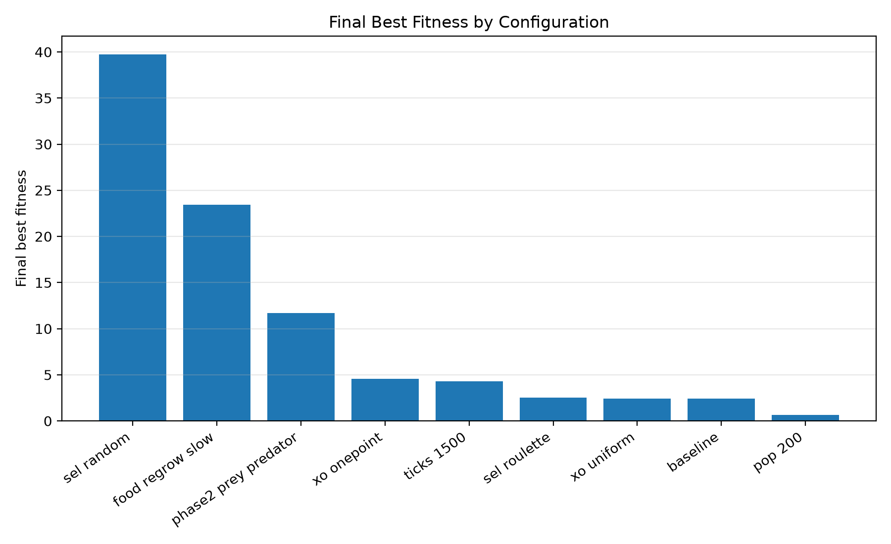

<div align="center">


# Designing Evolution
*How a genetic algorithm's design choices, like selection, crossover, mutation, and the harshness of the world, shape the outcome of evolution in a population of foraging agents.*

</div>

## Optimization, the nature-inspired way

Optimization is the problem of finding the best solution in a space too large to search by brute force. All you can really do is score a candidate and ask how good it is. Evolution has been solving exactly that problem for billions of years: generate variation, let the environment score it, keep what survives, repeat. Genetic algorithms borrow the trick wholesale.

This project is a small, concrete version of that idea: a population of simple foraging agents evolved by a genetic algorithm, with no hand-coded behaviour, just selection, crossover, and mutation acting on a few genes. The agents themselves are almost beside the point. What's actually under test is the GA's own design: how parents get picked, how genes recombine, how much mutation noise gets injected, how harsh the world is. Those choices are what the experiments in this repo are really about.

## The simulation

<p align="center" width="100%">
<video src="https://github.com/user-attachments/assets/563d36e5-1c92-49e6-aa88-c873a20ddf1d" width="80%" controls></video>
</p>

Each agent's behaviour comes from its genome, a vector of real-valued traits. By default that's speed, vision (how far it can sense food), turn rate, and energy cost, so no two agents act alike.

Agents live on a toroidal, wrap-around grid scattered with food. Every generation, each genome gets simulated for a fixed lifetime. An agent senses the nearest food within its vision radius, steers toward it within its turn rate, and moves at its speed. Moving and sensing both burn energy, roughly proportional to speed squared and vision squared, and an agent that runs out of energy dies. Fitness is just the net result of all that: total energy eaten minus total energy spent.

The GA loop itself is standard. Each generation it evaluates fitness, keeps the elites, selects parents, crosses them over, mutates the offspring, and repeats. Selection, crossover, and mutation are all pluggable: each is registered by name in `foraging/ga_selection.py`, `ga_crossover.py`, and `ga_mutation.py`, so adding a new operator is just a matter of registering a function under a name.

Phase 2 adds an optional extension: simple predators that chase and kill foragers, layering a second survival pressure on top of the energy economy.

Every run is driven entirely by config: YAML first, then environment variables, then CLI overrides (see `foraging/config.py`). A new experiment is usually just a new YAML file.

## What each phase was testing

### Phase 1: does the GA's own design matter?
A one-factor-at-a-time sweep against a shared baseline (pop 100, tournament selection k=3, uniform crossover, gaussian mutation, 1000-tick lifetime, scattered food, no regrowth). Each sub-experiment changes exactly one knob to isolate its effect:

| Question | Factor varied |
|---|---|
| Does *how* parents are chosen matter? | Selection: `random` vs `roulette` vs `tournament` |
| Does *how* genes recombine matter? | Crossover: `one_point` vs `uniform` |
| How much exploration noise is too much or too little? | Mutation rate: p in {0.01, 0.02, 0.05, 0.10} |
| Does a bigger gene pool help? | Population size: 50 vs 200 |
| Does resource scarcity change what evolves? | Food: scattered/no regrowth vs slow regrowth |
| Does a longer "life" per generation give a cleaner signal? | Lifetime: 500 vs 1500 ticks |

### Phase 2: what happens under a second survival pressure?
Same world, but with 12 simple predators added that chase and kill foragers. The question is whether predation on top of the energy economy changes what the GA evolves toward. In this implementation foragers have no gene for sensing or evading predators, so it ends up closer to added random mortality than a genuine predator-prey arms race (see Known limitations below).

### Phase 3: can the best ideas from Phase 1 be combined?
An attempt to combine Phase 1's findings into one best recipe: slow food regrowth, longer lifetimes, a bigger population, and a selection-pressure annealing schedule that starts with weak, random selection to explore broadly and anneals into strong tournament selection later to exploit what's been found.

- `synth_best.yml`: the full recipe, annealed selection plus slow regrowth plus a reduced genome.
- `synth_no_anneal.yml`: a control with the same world but fixed tournament selection instead of the schedule.
- `synth_no_regrow.yml`: a control with the same schedule but no food regrowth.

## What we found



With food regrowth, mean fitness over 50 generations settles strongly positive, around +19. Without it, the population runs the environment dry and mean fitness goes negative, around -6. It's the cleanest, most reproducible effect across the whole experiment set (see `results/new/synth_summary.csv`).

Selection pressure interacts with fitness noise in a way that isn't obvious going in. Each generation's fitness comes from a single stochastic rollout (food layout and starting positions are redrawn fresh every generation), so it's a noisy signal to select on. Under that noise, plain `random` parent selection, with no pressure beyond keeping the top two elites, ended up with the highest best fitness of any Phase 1 selection variant (chart above). Tournament and roulette selection collapse population diversity hard, down to 0.03-0.07 by the end, by converging on whichever genome happened to get a lucky sample. Random selection keeps exploring instead, and its final diversity stays close to 1.0. It's a decent little demonstration of premature convergence under noisy fitness evaluation.

The annealed selection schedule was the headline idea of Phase 3: explore broadly early with random selection, then exploit late with tournament selection. It's implemented as a generation-ranged lookup in `ga_core.evolve` (see `selection_cfg_for_gen`).

## Running it

```bash
pip install -r requirements.txt

# headless run, writes <run_name>.csv + metrics.jsonl + checkpoints
python scripts/run_experiment.py experiments/phase1/baseline.yml

# override any config key from the CLI
python scripts/run_experiment.py experiments/phase1/baseline.yml ga.generations=20 ga.pop_size=50

# live matplotlib viewer (agents colour-coded by energy)
python -m foraging.cli_live --config experiments/phase2/prey-predator.yml

# plot a single run's fitness/diversity curves
python scripts/plot.py runs/p1_baseline/p1_baseline.csv

# rebuild the cross-experiment summary tables and comparison plots
python scripts/aggregate_results.py
python scripts/compare_plots.py

# record a GIF of the simulation (writes images/demo.gif)
python scripts/record_gif.py
```

## Project structure

```
foraging/        the simulator + GA (config, genome, world, operators, live viewer)
experiments/     YAML configs for phase1 / phase2 / Phase3
scripts/         headless runner, single-run plotting, cross-experiment aggregation
runs/            per-experiment output (<run_name>.csv, metrics.jsonl, plots, checkpoints)
results/         cross-experiment summary tables and comparison plots
```

## Known limitations

- Predators in Phase 2 apply attrition independent of the forager genome. There's no evolved evasion behaviour.
- `world.torus` and `world.death` are accepted in configs but aren't actually togglable. The world always wraps, and agents always die at zero energy.
- The `curiosity` gene in `synth_best.yml` rides along in the genome and affects mutation and diversity bookkeeping, but has no simulated behavioural effect. There's no curiosity-driven movement implemented in `world.py`.
- Fitness comes from a single stochastic rollout per generation rather than an average over repeated trials. That's the main source of the noisy, non-monotonic fitness curves in every run's CSV.
